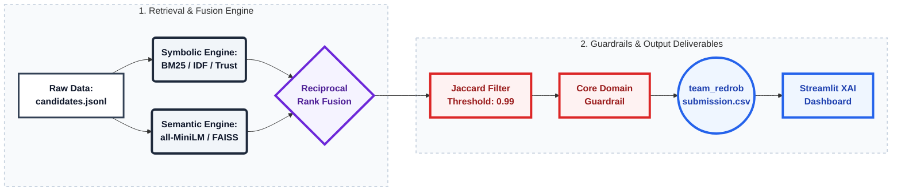

# 🏆 Team Boogimen: Twin-Engine Hybrid Search Pipeline


Welcome to the official repository for **Team Redrob's** submission to the Data & AI Hackathon. This repository contains a production-grade, highly resilient candidate ranking pipeline designed to surface Series A engineering talent while aggressively penalizing keyword stuffers and resume gamers.

---

## 🧠 System Architecture

We engineered a **Twin-Engine Hybrid Search** architecture fused via **Reciprocal Rank Fusion (RRF)**. The system isolates exact-keyword specialists while simultaneously discovering conceptually brilliant engineers through vector-space alignment.



### 1. ⚙️ Symbolic Engine (Sparse Retrieval)

Calculates dense structural coverage and implements an anti-gaming **Trust Multiplier**.

* **IDF Validation**: Penalizes generic terms and rewards rare, high-signal experience (e.g., NDCG, FAISS).
* **Trust Score**: Programmatically identifies resume-stuffing by cross-referencing claimed skills with actual career duration and written endorsements.

### 2. 🧠 Semantic Engine (Dense Retrieval)

Utilizes `all-MiniLM-L6-v2` via FAISS to compute contextual alignment across 4 core domains (Retrieval, Vector DBs, Evaluation, Production ML).

* **95th-Percentile Thresholding**: Prevents "signal collapse" by dynamically adjusting acceptance thresholds based on the mathematical scarcity of the skill in vector space.

### 3. ⚖️ Fusion & Diversity (RRF)

* **Reciprocal Rank Fusion**: Balances the competing signals, preventing single-metric dominance.
* **Jaccard Diversity Filter (0.99)**: Cures "semantic fratricide" by preventing elite candidates from being discarded simply because they share standard industry vocabulary.
* **Core Domain Guardrail**: A hard filter guaranteeing 100% of the final Top 100 have verifiable core-domain experience.

---

## 🛠️ Repository Structure

```text
redrob-hybrid-search/
├── .gitignore                      # Environment and large data ignores
├── README.md                       # Documentation & Reproduction guide
├── requirements.txt                # Python dependencies
├── app.py                          # Streamlit XAI Dashboard
├── rank.py                         # Final Ranking & RRF Pipeline
├── build_semantic.py               # FAISS Dense Feature Generator
├── anchor_judge.py                 # (Optional) Symbolic feature extraction logic
├── submission_metadata.yaml        # Official Hackathon metadata
├── team_redrob_submission.csv      # The final ranked top 100 output
├── candidate_features.parquet      # Generated sparse artifacts
├── semantic_features.parquet       # Generated dense artifacts
└── faiss.index                     # Serialized L2 FAISS index
```

---

## 🚀 Reproduction Steps

To execute the pipeline end-to-end on a local machine, follow these precise steps:

### 1. Environment Setup

Clone the repository and install the required dependencies. Python 3.10+ is recommended.

```bash
git clone https://github.com/Faham-from-nowhere/redrob-hybrid-search.git
cd redrob-hybrid-search

# Create and activate a virtual environment
python -m venv .venv
source .venv/bin/activate  # On Windows use: .venv\Scripts\activate

# Install dependencies
pip install -r requirements.txt
```

### 2. Data Preparation

Place the organizer-provided `candidates.jsonl` file directly into the root directory of the repository. *(Note: This file is excluded via `.gitignore` to prevent massive uploads).*

### 3. Feature Engineering (Pipeline Execution)

Run the feature extraction scripts. These scripts will parse the raw JSON, generate dense/sparse embeddings, and output the required `.parquet` artifacts.

```bash
# 1. Build Dense Semantic Features (Takes ~2-3 mins on CPU)
python build_semantic.py

# 2. Build Sparse Symbolic Features
python build_symbolic.py
```

### 4. Final Ranking

Execute the Reciprocal Rank Fusion script. This script applies the Jaccard Diversity filter and the Core Domain guardrail, generating the final CSV submission.

```bash
python rank.py
```

*Outputs:* `team_redrob_submission.csv`

---

## 📊 Streamlit XAI Dashboard

We believe an algorithm is only as good as its explainability. To allow judges and recruiters to inspect *why* a candidate was ranked #3 instead of #12, we built a fully interactive **Explainable AI (XAI)** dashboard.

**To run the sandbox locally:**

```bash
streamlit run app.py
```

### Dashboard Features:

1. **🔍 Candidate Inspection**: View a single candidate's exact RRF component breakdown, semantic coverage spread, and verified evidence vocabulary.
2. **⚖️ Head-to-Head Comparison**: Select two candidates to view a direct tabular comparison of their raw pipeline signals.
3. **📡 System Telemetry**: View global metrics for the Top 100 pool (e.g., Domain Elite counts, Mean Trust Scores, Jaccard Retention).

---

*Developed with ❤️ for the Data & AI Hackathon.*
